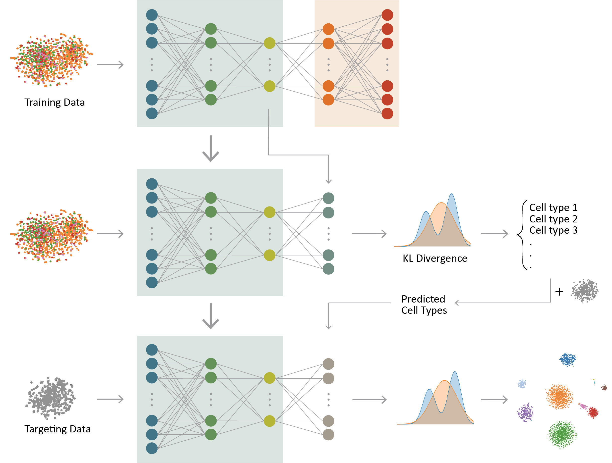

# ItClust

## ItClust: Transfer learning improves clustering and cell type classification in single-cell RNA-seq analysis

ItClust is an Iterative Transfer learning algorithm for scRNA-seq Clustering. It starts from building a training neural network to extract gene-expression signatures from a well-labeled source dataset. This step enables initializing the target network with parameters estimated from the training network. The target network then leverages information in the target dataset to iteratively fine-tune parameters in an unsupervised manner, so that the target-data-specific gene-expression signatures are captured. Once fine-tuning is finished, the target network then returns clustered cells in the target data.
ItClust has shown to be a powerful tool for scRNA-seq clustering and cell type classification analysis. It can accurately extract information from source data and apply it to help cluster cells in target data. It is robust to strong batch effect between source and target data, and is able to separate unseen cell types in the target. Furthermore, it provides confidence scores that facilitates cell type assignment. With the increasing popularity of scRNA-seq in biomedical research, we expect ItClust will make better utilization of the vast amount of existing well annotated scRNA-seq datasets, and enable researchers to accurately cluster and annotate cells in scRNA-seq.

For thorough details, see the preprint: [Bioxiv]()
 

## Usage

The [**ItClust**](https://github.com/jianhuupenn/ItClust) package is an implementation of Iterative Transfer learning algorithm for scRNA-seq Clustering. With ItClust, you can:

- Preprocess single cell gene expression data from various formats.
- Build a network for target data clustering with prioe knowledge learnt from the source data.
- Obtain soft-clustering assignments of cells.
- Obtain cell type confidence score for each clsuter to assist cell type assignment.
- Visualize cell clustering/classification results and gene expression patterns.

 
For tutorial, please refer to: https://github.com/jianhuupenn/ItClust/blob/master/tutorial/tutorial.md

## Contributing

Souce code: [Github](https://github.com/jianhuupenn/ItClust)  
Author email: jianhu@pennmedicine.upenn.edu
We are continuing adding new features. Bug reports or feature requests are welcome.

 

## Reference

Please consider citing the following reference:

- 
 
