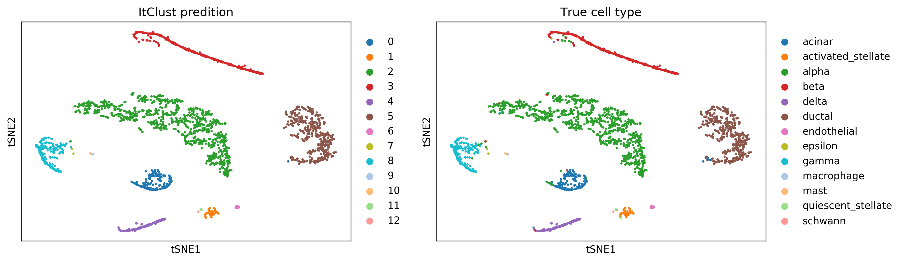
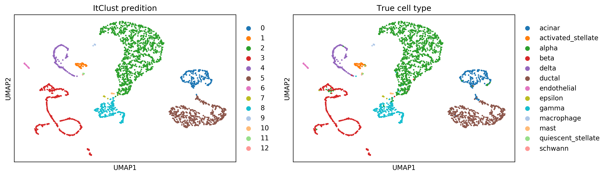

<h1><center>ItClust Tutorial</center></h1>


<center>Author: Jian Hu, Xiangjie Li, Gang Hu, Yafei Lyu, Katalin Susztak, Mingyao Li*</center>


### 0. Installation

To install  `ItClust` package you must make sure that your python version is either  `3.5.x` or `3.6.x`. If you don’t know the version of python you can check it by:
```python
import platform
platform.python_version()
#3.7.0
```
**Note:** Because ItClust depends on `tensorflow`, you should make sure the version of `tensorflow` is lower than `2.0`. If you want to get the same results as the results in our paper.
```
import tensorflow as tf
tf.__version__
#1.7.0
```
Now you can install the current release of `ItClust` by the following three ways.

* PyPI  
Directly install the package from PyPI.

```bash
pip3 install ItClust
```
**Note**: you need to make sure that the `pip` is for python3，or we should install ItClust by
```bash 
python3 -m pip install ItClust
#or
pip3 install ItClust
```

If you do not have permission (when you get a permission denied error), you should install ItClust by 

```bash
pip3 install --user  ItClust
```

* Github  
Download the package from [Github]() and install it locally:

```bash
git clone https://github.com/jianhuupenn/ItClust
cd ItClust/ItClust_package/
python3 setup.py install --user
```

* Anaconda

If you do not have  Python3.5 or Python3.6 installed, consider installing Anaconda  (see [Installing Anaconda](https://docs.anaconda.com/anaconda/install/)). After installing Anaconda, you can create a new environment, for example, `ItClust` (*you can change to any name you like*):

```bash
# create an environment called ItClust
conda create -n ItClust python=3.7.0
# activate your environment 
conda activate ItClust
git clone https://github.com/jianhuupenn/ItClust
cd ItClust/ItClust_package/
python3 setup.py build
python3 setup.py install

# now you can check whether `ItClust` installed successfully!
```

The installation should take within 30 seconds.
<br>


### 1. Import python modules


```python
import ItClust as ic
import scanpy.api as sc
import os
from numpy.random import seed
from tensorflow import set_random_seed
import pandas as pd
import numpy as np
import warnings
os.environ["CUDA_VISIBLE_DEVICES"]="1"
warnings.filterwarnings("ignore")
#import sys
#!{sys.executable} -m pip install 'scanpy==1.4.4.post1'
#Set seeds
seed(20180806)
np.random.seed(10)
set_random_seed(20180806) # on GPU may be some other default

```

    Using TensorFlow backend.


### 2. Read in data
The current version of ItClust works with an AnnData object. AnnData stores a data matrix .X together with annotations of observations .obs, variables .var and unstructured annotations .uns. The ItClust package provides 3 ways to prepare an AnnData object for the following analysis.
<br>
ItClust supports most forms of the scRNAseq data, including UMI, TPM, FPKM.
<br>
<br>
Important Note: For the source data, please store the true cell type label information in one column named "cell type".

#### 1.1 Start from a 10X dataset
Here we use the pbmc data as an example:
Download the data and unzip it. Then move the data to data/pbmc/.


```python
adata = ic.read_10X(data_path='./data/pbmc')
```

    var_names are not unique, "make_index_unique" has applied


#### 2.2  Start from *.mtx and *.tsv files
When the expression data do not follow the standard 10X dataset format, we can manually import the data as follows.


```python
#1 Read the expression matrix from *.mtx file.
# The rows of this matrix correspond to cells, columns corresond to genes. 
adata = read_mtx('./data/pbmc/matrix.mtx').T 

#2 Read the *.tsv file for gene annotations. Make sure the gene names are unique.
genes = pd.read_csv('./data/pbmc/genes.tsv', header=None, sep='\t')
adata.var['gene_ids'] = genes[0].values
adata.var['gene_symbols'] = genes[1].values
adata.var_names = adata.var['gene_symbols']
# Make sure the gene names are unique
adata.var_names_make_unique(join="-")

#3 Read the *.tsv file for cell annotations. Make sure the cell names are unique.
cells = pd.read_csv('./data/pbmc/barcodes.tsv', header=None, sep='\t')
adata.obs['barcode'] = cells[0].values
adata.obs_names = cells[0]
# Make sure the cell names are unique
adata.obs_names_make_unique(join="-")
```

    Variable names are not unique. To make them unique, call `.var_names_make_unique`.


#### 2.3 Start from a *.h5ad file
We will use human pancreas data as our example for transfer learning.
The Baron et al. data is used as source data and Segerstolpe et al. is treated as traget data. We can use the following codes to read data in from *.h5ad files:


```python
adata_train=sc.read("./data/pancreas/Bh.h5ad")
adata_test=sc.read("./data/pancreas/smartseq2.h5ad")
```

### 3. Fit ItClust model
ItClust includes preprocessing steps, that is, filtering of cells/genes, normalization, scaling and selection of highly variables genes.


```python
clf=ic.transfer_learning_clf()
clf.fit(adata_train, adata_test)
```
    the var_names of adata.raw: adata.raw.var_names.is_unique=: True
    The number of training cell types is:  14
    Training the source network
    The layer numbers are[32, 16]
    The shape of xtrain is:8569:867
    The shape of xtest is:2394:867
    Doing DEC: pretrain    
    ...Pretraining...
    Doing SAE: pretrain_stacks
    Pretraining the 1th layer...
    learning rate = 0.1

    learning rate = 0.01
    learning rate = 0.001
    The 1th layer has been pretrained.
    Pretraining the 2th layer...
    learning rate = 0.1
    learning rate = 0.01
    learning rate = 0.001
    The 2th layer has been pretrained.
    Doing SAE: pretrain_autoencoders
    Copying layer-wise pretrained weights to deep autoencoders
    Fine-tuning autoencoder end-to-end
    learning rate = 0.1
    learning rate = 0.010000000000000002
    learning rate = 0.001
    learning rate = 0.0001
    learning rate = 1e-05
    learning rate = 1.0000000000000002e-06
    Pretraining time:  158.4946711063385
    y known, initilize Cluster centroid using y
    The shape of cluster_center is (14, 16)
    Doing DEC: fit_supervised
    Training model finished! Start to fit target network!
    Doing DEC: pretrain_transfer
    The shape of features is (2394, 16)
    The shape of y_trans is (2394,)
    ...predicted y_test known, use it to get n_cliusters and init_centroid
    The length layers  of self.model 4
    Doing DEC: fit_trajectory
    The value of delta_label of current 1 th iteration is 0.002506265664160401 >= tol [0.001]
    This is the iteration of  0
    The value of delta_label of current 2 th iteration is 0.004177109440267335 >= tol [0.001]
    The value of delta_label of current 3 th iteration is 0.001670843776106934 >= tol [0.001]
    delta_label  0.000835421888053467 < tol  [0.001]
    Reached tolerance threshold. Stopped training.
    The final prediction cluster is:
    2     988
    5     457
    3     323
    8     210
    0     182
    4     126
    1      56
    6      22
    10      8
    9       7
    7       7
    11      6
    12      2
    dtype: int64
    How many trajectories  1


### 4. Prediction
predict() function will return the cluster prediction, clustering probability matrix and cell type confidence score. 

If the parameter write==True(default), it will also write the results to save_dir.

The cluster prediction is written to save_dir+"/clustering_results.csv".

The cell type confidence score is written to save_dir+"/cell type_assignment.txt".

The clustering probability matrix is written to save_dir+"/clustering_prob.csv".


```python
pred, prob, cell_type_pred=clf.predict()
pred.head()
```


<div>
<table border="1" class="dataframe">
  <thead>
    <tr style="text-align: right;">
      <th></th>
      <th>cell_id</th>
      <th>cluster</th>
    </tr>
  </thead>
  <tbody>
    <tr>
      <th>0</th>
      <td>AZ_A2-target</td>
      <td>8</td>
    </tr>
    <tr>
      <th>1</th>
      <td>AZ_H5-target</td>
      <td>8</td>
    </tr>
    <tr>
      <th>2</th>
      <td>AZ_G5-target</td>
      <td>8</td>
    </tr>
    <tr>
      <th>3</th>
      <td>AZ_D8-target</td>
      <td>8</td>
    </tr>
    <tr>
      <th>4</th>
      <td>AZ_D12-target</td>
      <td>8</td>
    </tr>
  </tbody>
</table>
</div>


### 5. Visualization
#### 5.1 t-SNE


```python
import matplotlib
matplotlib.use("Agg")
matplotlib.rcParams['figure.dpi']= 300
colors_use=['#1f77b4', '#ff7f0e', '#2ca02c', '#d62728', '#9467bd', '#8c564b', '#e377c2', '#bcbd22', '#17becf', '#aec7e8', '#ffbb78', '#98df8a', '#ff9896','#bec1d4','#bb7784','#4a6fe3','#FFFF00''#111010']
# Run t-SNE
clf.adata_test.obsm['X_tsne']=clf.tSNE()
num_celltype=len(clf.adata_test.obs["celltype"].unique())
clf.adata_test.uns["celltype_colors"]=list(colors_use[:num_celltype])
clf.adata_test.uns["decisy_trans_True_colors"]=list(colors_use[:num_celltype])
sc.pl.tsne(clf.adata_test,color=["decisy_trans_True","celltype"],title=["ItClust predition","True cell type"],show=True,size=50000/clf.adata_test.shape[0])
```

    Doing t-SNE!
    WARNING: Consider installing the package MulticoreTSNE (https://github.com/DmitryUlyanov/Multicore-TSNE). Even for n_jobs=1 this speeds up the computation considerably and might yield better converged results.





#### 5.2 U-map


```python
clf.adata_test.obsm['X_umap']=clf.Umap()
sc.pl.umap(clf.adata_test,color=["decisy_trans_True","celltype"],show=True,save=None,title=["ItClust predition","True cell type"],size=50000/clf.adata_test.shape[0])
```




